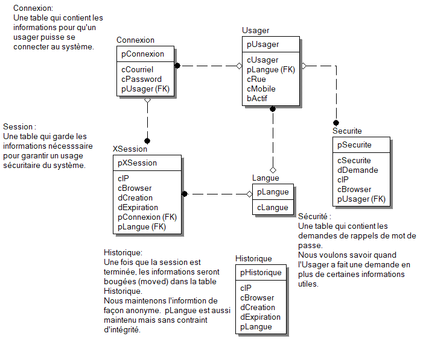

##### Droits d'auteur :copyright: matériel protégé 
 Si vous n'êtes pas étudiant du cours INF3080-030 A2019 vous devez 
 - demander une permission pour l'utilisation de ce matériel;
 - fournir la raison de son usage;

# Séance 8: Oracle PL/SQL

- Objectif : Expérimenter le pl/sql et la création de procédures, fonctions et gachettes.

Vous avez 2 heures.
   
----
**Note** : (_facultatif_) S'il y a des questions dans ce labo, répondez y dans un fichier nommé
`./labo/reponse-labo.md`.  Le fichier doit être dans un format `Markdown`. Utilisez le projet
`in3080-a2019` pour déposer le fichier demandé. Utiliser le même fichier pour tous les exercices.

##### Format du fichier Markdown
 + Séance 2 (Header 1)
 + Exercice {1..n} (H2)
 + Question {1..n} (H4)
 + S`2`.E`3`.Q`1` (strong) `est une valeur qui change bien sûr`
 + La réponse dans une section script (code block)

**Note**: Il est recommandé de versionner vos réponses aux exercices à l'aide
de Git. Un seul dépôt est amplement suffisant pour tous les laboratoires, en
divisant les fichiers dans des répertoires.

 > > Pourquoi versionner vos exercices avec Git: afin de
vous entraîner à utiliser le logiciel (commandes) naturellement.

----

## 0 - Directives

+ Faites le maximum selon vos connaissances;
+ Lire l'atelier complètement;
+ Ce devoir utilise le schéma de base de données [modèle A](./modele_labo.png);
+ Je vais vérifier (lire) les devoirs;

Vous devez créer un script  nommé `labo08.sql` qui contiendra les réponses pour toutes les exercices qui suivent.
Vous devez pour ce travail utiliser le schéma de base de données [modèle A](./modele_labo.png). Les modifications sont
incrémentales. Il faut sauvegarder vos changements dans la BD.

## 1 - Gachette et Sequence

Vous devez créer des gachettes qui sont en mesure de faire le travail de gestion des clés (auto incréments) de toutes les tables.  

+ Q1. À quoi ressemble l'insertion avant et après la création d'une gachette sur la table `Usager` ?  

## 2 - Procédure, fonction et gachette

Vous devez construire une procédure nommée `p_change_pw(cOldPW, cNewPW, pUsager, cIP, cBrowser);`  Celle-ci devra valider que le vieux
password est conforme (via une fonction).  Elle devra aussi ajouter à la table `Securite` la demande de changement (via une gachette).

+ Q1. Quelle est la signature (prototype) de votre fonction ?
+ Q2. Quel est le nom (significatif) de votre gachette ?

**NOTE** je peux savoir seulement avec le nom que vous avez compris ou pas.

## 3 - Gestion des erreurs

Dans la procédure (ou autres programmes) il est nécessaire d'ajouter une gestion des erreurs pour garder la base de données consistante.
Faire les changements nécessaires pour avec un nouveau CREATE qui remplacera le code fait au numéro #2.

+ Q1. Avec quelle commande est-il possible d'écraser du code dans la BD ?

### FIN.

---

Auteur Guy Francoeur :copyright: version A2019
